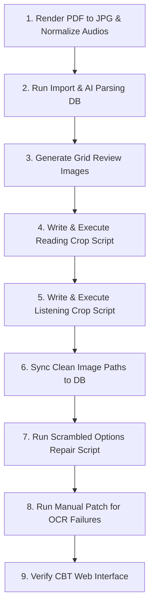

# Ingesting TOPIK II Full Exam (Reading & Listening)

## Overview
Quy trình chuẩn hóa toàn bộ để chuyển đổi một kỳ thi TOPIK II chính thức (gồm cả phần Đọc - Reading và Nghe - Listening) từ tài liệu PDF gốc và file âm thanh nguồn thành các câu hỏi tương tác hoàn chỉnh trên website CBT.

Quy trình này đảm bảo:
1. Cơ sở dữ liệu Supabase chứa đầy đủ và chính xác 50 câu hỏi Đọc và 50 câu hỏi Nghe.
2. Mọi câu hỏi đều có ảnh cắt được căn chỉnh đúng quy chuẩn hiển thị của CBT (Cắt rộng chứa đáp án cho câu ngắn, cắt sạch cho câu thông thường, cắt chỉ khung đen cho câu dài).
3. Audio phần nghe được liên kết chính xác cho từng câu hỏi và giới hạn số lần nghe theo cài đặt.
4. Thứ tự đáp án trắc nghiệm dưới web trùng khớp hoàn toàn với thứ tự hiển thị trên ảnh đề thi gốc bằng thuật toán sắp xếp dựa trên tọa độ OCR.

---

## TOPIK II Reading Prompt Canonical Map

Không để AI/OCR tự quyết định `question_text` cho phần Đọc. Format TOPIK II Reading là cố định theo số câu, vì vậy khi import hoặc vá DB phải dùng bảng chuẩn dưới đây. `instructions` có thể là header theo range, nhưng `question_text` phải là prompt riêng của từng câu:

```python
TOPIK_READING_QUESTION_PROMPTS = {
    1: "( )에 들어갈 말로 가장 알맞은 것을 고르십시오.",
    2: "( )에 들어갈 말로 가장 알맞은 것을 고르십시오.",
    3: "밑줄 친 부분과 의미가 가장 비슷한 것을 고르십시오.",
    4: "밑줄 친 부분과 의미가 가장 비슷한 것을 고르십시오.",
    5: "다음은 무엇에 대한 글인지 고르십시오.",
    6: "다음은 무엇에 대한 글인지 고르십시오.",
    7: "다음은 무엇에 대한 글인지 고르십시오.",
    8: "다음은 무엇에 대한 글인지 고르십시오.",
    9: "다음 글 또는 그래프의 내용과 같은 것을 고르십시오.",
    10: "다음 글 또는 그래프의 내용과 같은 것을 고르십시오.",
    11: "다음 글 또는 그래프의 내용과 같은 것을 고르십시오.",
    12: "다음 글 또는 그래프의 내용과 같은 것을 고르십시오.",
    13: "다음을 순서에 맞게 배열한 것을 고르십시오.",
    14: "다음을 순서에 맞게 배열한 것을 고르십시오.",
    15: "다음을 순서에 맞게 배열한 것을 고르십시오.",
    16: "( )에 들어갈 말로 가장 알맞은 것을 고르십시오.",
    17: "( )에 들어갈 말로 가장 알맞은 것을 고르십시오.",
    18: "( )에 들어갈 말로 가장 알맞은 것을 고르십시오.",
    19: "( )에 들어갈 말로 가장 알맞은 것을 고르십시오.",
    20: "윗글의 주제로 가장 알맞은 것을 고르십시오.",
    21: "( )에 들어갈 말로 가장 알맞은 것을 고르십시오.",
    22: "윗글의 내용과 같은 것을 고르십시오.",
    23: "밑줄 친 부분에 나타난 '나'의 심정으로 가장 알맞은 것을 고르십시오.",
    24: "윗글의 내용과 같은 것을 고르십시오.",
    25: "다음 신문 기사의 제목을 가장 잘 설명한 것을 고르십시오.",
    26: "다음 신문 기사의 제목을 가장 잘 설명한 것을 고르십시오.",
    27: "다음 신문 기사의 제목을 가장 잘 설명한 것을 고르십시오.",
    28: "( )에 들어갈 말로 가장 알맞은 것을 고르십시오.",
    29: "( )에 들어갈 말로 가장 알맞은 것을 고르십시오.",
    30: "( )에 들어갈 말로 가장 알맞은 것을 고르십시오.",
    31: "( )에 들어갈 말로 가장 알맞은 것을 고르십시오.",
    32: "다음을 읽고 글의 내용과 같은 것을 고르십시오.",
    33: "다음을 읽고 글의 내용과 같은 것을 고르십시오.",
    34: "다음을 읽고 글의 내용과 같은 것을 고르십시오.",
    35: "다음을 읽고 글의 주제로 가장 알맞은 것을 고르십시오.",
    36: "다음을 읽고 글의 주제로 가장 알맞은 것을 고르십시오.",
    37: "다음을 읽고 글의 주제로 가장 알맞은 것을 고르십시오.",
    38: "다음을 읽고 글의 주제로 가장 알맞은 것을 고르십시오.",
    39: "주어진 문장이 들어갈 곳으로 가장 알맞은 것을 고르십시오.",
    40: "주어진 문장이 들어갈 곳으로 가장 알맞은 것을 고르십시오.",
    41: "주어진 문장이 들어갈 곳으로 가장 알맞은 것을 고르십시오.",
    42: "밑줄 친 부분에 나타난 '미연'의 심정으로 가장 알맞은 것을 고르십시오.",
    43: "윗글의 내용으로 알 수 있는 것을 고르십시오.",
    44: "( )에 들어갈 말로 가장 알맞은 것을 고르십시오.",
    45: "윗글의 주제로 가장 알맞은 것을 고르십시오.",
    46: "윗글에 나타난 필자의 태도로 가장 알맞은 것을 고르십시오.",
    47: "윗글의 내용과 같은 것을 고르십시오.",
    48: "윗글을 쓴 목적으로 가장 알맞은 것을 고르십시오.",
    49: "( )에 들어갈 말로 가장 알맞은 것을 고르십시오.",
    50: "윗글의 내용과 같은 것을 고르십시오.",
}
```

Trong repo hiện có helper chuẩn tại `client/scripts/topik_reading_prompts.py`. Khi viết `import_exam_XX.py`, phần Reading phải dùng:

```python
from topik_reading_prompts import get_reading_question_prompt, get_reading_range_instruction

inst = get_reading_range_instruction(q_num)
q_text = get_reading_question_prompt(q_num)
```

Không dùng `q_parsed["question_text"]` từ AI cho Reading, trừ khi người dùng chủ động yêu cầu một đề ngoài format TOPIK II chuẩn.

Sau khi import xong một đề đã có trong DB, có thể patch lại prompt chuẩn bằng script generic:

```powershell
node client\scripts\patch_topik_exam_prompts.cjs --exam=83 --section=all
```

`--section` nhận `reading`, `listening`, hoặc `all`. Script này tự đọc `client/scripts/ingestion_progress_XX.json`, patch Reading đủ 50 câu, patch Listening các câu cố định và chỉ giữ nguyên `question_text` của Listening Q44.

## TOPIK II Listening Prompt Canonical Map

Phần Nghe phần lớn có format cố định. Khi import hoặc vá DB, không để AI/OCR đoán `question_text` cho các câu cố định; dùng helper `client/scripts/topik_listening_prompts.py`:

```python
from topik_listening_prompts import get_listening_question_prompt, get_listening_range_instruction

inst = get_listening_range_instruction(q_num)
q_text = get_listening_question_prompt(q_num)
```

Prompt chuẩn theo số câu:

```python
TOPIK_LISTENING_QUESTION_PROMPTS = {
    1: "다음을 듣고 가장 알맞은 그림 또는 그래프를 고르십시오.",
    2: "다음을 듣고 가장 알맞은 그림 또는 그래프를 고르십시오.",
    3: "다음을 듣고 가장 알맞은 그림 또는 그래프를 고르십시오.",
    4: "다음을 듣고 이어질 수 있는 말로 가장 알맞은 것을 고르십시오.",
    5: "다음을 듣고 이어질 수 있는 말로 가장 알맞은 것을 고르십시오.",
    6: "다음을 듣고 이어질 수 있는 말로 가장 알맞은 것을 고르십시오.",
    7: "다음을 듣고 이어질 수 있는 말로 가장 알맞은 것을 고르십시오.",
    8: "다음을 듣고 이어질 수 있는 말로 가장 알맞은 것을 고르십시오.",
    9: "다음을 듣고 여자가 이어서 할 행동으로 가장 알맞은 것을 고르십시오.",
    10: "다음을 듣고 여자가 이어서 할 행동으로 가장 알맞은 것을 고르십시오.",
    11: "다음을 듣고 여자가 이어서 할 행동으로 가장 알맞은 것을 고르십시오.",
    12: "다음을 듣고 여자가 이어서 할 행동으로 가장 알맞은 것을 고르십시오.",
    13: "다음을 듣고 들은 내용과 같은 것을 고르십시오.",
    14: "다음을 듣고 들은 내용과 같은 것을 고르십시오.",
    15: "다음을 듣고 들은 내용과 같은 것을 고르십시오.",
    16: "다음을 듣고 들은 내용과 같은 것을 고르십시오.",
    17: "다음을 듣고 남자의 중심 생각으로 가장 알맞은 것을 고르십시오.",
    18: "다음을 듣고 남자의 중심 생각으로 가장 알맞은 것을 고르십시오.",
    19: "다음을 듣고 남자의 중심 생각으로 가장 알맞은 것을 고르십시오.",
    20: "다음을 듣고 남자의 중심 생각으로 가장 알맞은 것을 고르십시오.",
    21: "남자의 중심 생각으로 가장 알맞은 것을 고르십시오.",
    22: "들은 내용과 같은 것을 고르십시오.",
    23: "남자가 무엇을 하고 있는지 고르십시오.",
    24: "들은 내용과 같은 것을 고르십시오.",
    25: "남자의 중심 생각으로 가장 알맞은 것을 고르십시오.",
    26: "들은 내용과 같은 것을 고르십시오.",
    27: "남자가 말하는 의도로 알맞은 것을 고르십시오.",
    28: "들은 내용과 같은 것을 고르십시오.",
    29: "남자가 누구인지 고르십시오.",
    30: "들은 내용과 같은 것을 고르십시오.",
    31: "남자의 중심 생각으로 가장 알맞은 것을 고르십시오.",
    32: "남자의 태도로 가장 알맞은 것을 고르십시오.",
    33: "무엇에 대한 내용인지 알맞은 것을 고르십시오.",
    34: "들은 내용과 같은 것을 고르십시오.",
    35: "남자가 무엇을 하고 있는지 고르십시오.",
    36: "들은 내용과 같은 것을 고르십시오.",
    37: "여자의 중심 생각으로 가장 알맞은 것을 고르십시오.",
    38: "들은 내용과 같은 것을 고르십시오.",
    39: "이 대화 전의 내용으로 가장 알맞은 것을 고르십시오.",
    40: "들은 내용과 같은 것을 고르십시오.",
    41: "이 강연의 중심 내용으로 가장 알맞은 것을 고르십시오.",
    42: "들은 내용과 같은 것을 고르십시오.",
    43: "무엇에 대한 내용인지 알맞은 것을 고르십시오.",
    # 44 is an exception: prompt depends on the specific passage topic, use AI/OCR.
    45: "들은 내용과 같은 것을 고르십시오.",
    46: "여자가 말하는 방식으로 알맞은 것을 고르십시오.",
    47: "들은 내용과 같은 것을 고르십시오.",
    48: "남자의 태도로 알맞은 것을 고르십시오.",
    49: "들은 내용과 같은 것을 고르십시오.",
    50: "남자의 태도로 알맞은 것을 고르십시오.",
}
```

Ngoại lệ quan trọng: **Listening Q44 không cố định**. Ví dụ có đề là `종묘 정전에 대한 설명으로 맞는 것을 고르십시오.`, nhưng đề khác có thể hỏi chủ đề khác. Vì vậy `get_listening_question_prompt(44)` phải trả rỗng và import script phải fallback về `q_parsed["question_text"]` từ AI/OCR cho riêng câu 44.

## Ingestion Step-by-Step Workflow



### Bước 1: Khởi tạo dữ liệu nguồn & Chuẩn hóa Audio
1. Nếu người dùng đưa folder nguồn, kiểm tra trước bằng `Get-ChildItem -LiteralPath "<folder>" -Force` và xác nhận có:
   - 2 file PDF đề: `...듣기.pdf`, `...읽기.pdf`
   - 1 file PDF đáp án chính thức
   - 51 file `.mp3`
2. Đặt các file PDF đề thi Đọc và Nghe vào các thư mục tương ứng:
   - Đọc: `client/public/topik_exams/ky_XX/reading/`
   - Nghe: `client/public/topik_exams/ky_XX/listening/`
3. Sử dụng thư viện PyMuPDF (`fitz`) để render toàn bộ các trang PDF thành ảnh JPG chất lượng cao (thường ở DPI 220).
4. Đổi tên toàn bộ 51 file âm thanh nghe nguồn (gốc từ NIIED) thành định dạng chuẩn: `track_01.mp3` -> `track_51.mp3` và lưu tại `client/public/topik_exams/ky_XX/listening/`.
   *Chú ý: Track 1 thường là nhạc dạo, các track tiếp theo ứng với từng câu hỏi.*

### Bước 2: Import & Phân tích cấu trúc đề qua AI (Supabase DB)
Tạo script import (ví dụ `import_exam_XX.py`) thực hiện các nhiệm vụ:
1. Khởi tạo/Tìm bản ghi Exam trong bảng `topik_exams` cho Đọc và Nghe.
2. Duyệt qua từng trang ảnh JPG, chạy OCR Space API để lấy văn bản thô.
3. Gửi văn bản OCR qua DeepSeek API (`deepseek-chat`) kèm theo danh sách Đáp án Chính thức (Answer Key) của kỳ thi để cấu trúc hóa thành câu hỏi JSON.
4. Lưu hoặc Cập nhật (patch) câu hỏi vào bảng `topik_exam_questions` trong Supabase.
   - **Tập tin Audio:** Được gán tự động vào trường `passage` của câu hỏi nghe tương ứng (Q1-Q20: track_02 -> track_21; Q21-Q50: các câu hỏi cặp dùng chung track audio).

### Bước 3: Vẽ lưới tọa độ Grid Review
Chạy script vẽ các đường lưới ngang màu đỏ cách nhau 50px (kèm chữ số chỉ tọa độ Y) đè lên các ảnh trang đề thi gốc và lưu vào thư mục `client/scripts/crop_review/topikXX_reading_grid` và `topikXX_listening_grid`.
*Mục đích: Giúp dễ dàng tra cứu tọa độ Y chính xác của các câu hỏi hoặc hình vẽ đáp án.*

#### Quy trình riêng cho PDF cũ/scan như TOPIK 60/64
Với các đề scan cũ, cách chuẩn nhất là dựng tọa độ trên ảnh render từ PyMuPDF rồi crop cố định theo manifest. Không dựa vào auto-tighten/OCR bands làm nguồn chính.

1. Render bằng PyMuPDF ở độ phân giải cao, sau đó đo `y1/y2` trên ảnh grid/render đó.
2. Ảnh crop phải giữ đủ dòng đề bài/câu số, passage/hộp khung đen, viền trên và viền dưới. Không được cắt mất dòng prompt đầu câu.
3. Sau khi import DB, chạy lại ảnh cũ bằng:
   ```powershell
   python client/scripts/rebuild_old_topik_reading_crops.py --exam=60 --source="C:\Users\Hhung\Downloads\64"
   ```
4. Luôn mở `client/scripts/crop_review/topikXX_reading_clean/contact_sheet.jpg` và xem bằng mắt trước khi báo xong.

### Bước 4: Thực hiện Crop hình ảnh phần Đọc (Reading)
Tạo script `crop_topikXX_reading_clean.py` để thực hiện cắt ảnh Đọc theo 3 quy chuẩn:
1. **Cắt rộng chứa cả đáp án (Q1-Q8, Q25-Q27):** Vì các câu hỏi này rất ngắn, ta tăng giới hạn dưới `y2` để ảnh chứa toàn bộ đề bài + các phương án trắc nghiệm ① ② ③ ④ gốc.
2. **Cắt chỉ lấy khung viền đen (Q42-Q50):** Đây là các câu hỏi dựa trên một đoạn văn chung rất dài ở cuối đề. Ta chỉ crop duy nhất phần đoạn văn nằm bên trong khung viền đen (bỏ qua câu hỏi con và đáp án ở dưới) để UI CBT không bị quá dài và tránh trùng lặp.
3. **Cắt sạch thông thường (Q9-Q41, trừ Q25-Q27):** Loại bỏ hoàn toàn các lựa chọn ① ② ③ ④ để hiển thị chuyên nghiệp dưới dạng các nút bấm tương tác HTML. Cần giới hạn `y2` vừa khít dưới câu hỏi/hộp thoại để tránh dính một phần viền trên của đáp án ① ở mép dưới ảnh.

#### Quy tắc bắt buộc khi crop khung đen phần Đọc
Lỗi thường gặp nhất là ảnh bị mất thanh viền dưới/trên vì thuật toán `tighten_vertical()` co crop theo chữ đen, bỏ qua đường khung mảnh. Khi crop bất kỳ câu nào có khung đen:

1. **Dò đường viền thật bằng pixel trước khi chỉnh tay.** Tìm các dòng ngang có nhiều pixel tối trong vùng nội dung:
   ```python
   from PIL import Image
   import numpy as np

   img = Image.open("client/public/topik_exams/ky_XX/reading/page_YY.jpg").convert("L")
   arr = np.array(img)
   lines = []
   for y in range(200, 2100):
       row = arr[y, 150:1565]
       if (row < 80).sum() > 800:
           lines.append(y)
   ```
2. **`y2` phải nằm sau đường viền dưới thật ít nhất 15-25px.** Nếu line dưới ở `y=1557`, đặt `y2` khoảng `1580`, không đặt `1540`.
3. **Không dùng auto-tighten mù cho khung viền.** Với câu có passage nằm trong khung đen, hoặc tắt co mép cho piece đó, hoặc đặt tọa độ đủ rộng rồi kiểm ảnh bằng mắt.
4. **Không để dính đáp án HTML bên dưới.** Nếu CBT đã hiển thị đáp án bằng nút bấm, crop chỉ giữ passage/câu hỏi, không lấy dòng `① ...` bên dưới.
5. **Luôn regen map sau khi crop:** script phải ghi lại `topikXX_reading_clean_map.json` với `pieces` và `size` mới.

Các nhóm Reading hay cần kiểm kỹ khung dưới: Q15-Q18, Q21-Q24, Q28-Q41, Q42-Q50. Với các nhóm nhiều câu chung passage, chấp nhận duplicate passage cho từng câu để người học nhìn đủ ngữ cảnh.

### Bước 5: Thực hiện Crop hình ảnh phần Nghe (Listening)
Tạo script `crop_topikXX_listening_clean.py` để thực hiện cắt ảnh Nghe sạch:
1. **Q1-Q3 (Câu hỏi hình ảnh/biểu đồ):** Cắt giữ lại toàn bộ nội dung hộp đối thoại và 4 hình vẽ đáp án bên dưới (sử dụng tọa độ Y cố định tra cứu từ ảnh Grid).
2. **Q4-Q6 (Hộp đối thoại đơn lẻ):** Sử dụng thuật toán tự động nhận diện dòng viền hộp thoại (`find_dark_lines`) để crop sạch chỉ chứa phần hướng dẫn + hộp đối thoại (không chứa các phương án trắc nghiệm dạng chữ).
3. **Q7-Q20 (Mỗi trang 2 câu đơn):** Tìm hộp thoại chẵn lẻ trong 2 nửa trang dựa trên logic lọc khoảng cách tối đa giữa các viền ngang.
4. **Q21-Q50 (Mỗi trang 1 hội thoại + 2 câu hỏi):** Định vị phần đáy hộp hội thoại chung, sau đó sử dụng thuật toán tìm text bands để tự động lấy dòng câu hỏi lẻ (Band 0) và dòng câu hỏi chẵn (Band 5) ghép với hội thoại chung.

### Bước 6: Đồng bộ hóa Đường dẫn ảnh vào DB
Viết script `sync_topikXX_clean_paths.py`:
1. Đọc file map JSON của Đọc và Nghe.
2. Sử dụng API Supabase PATCH để cập nhật trường `audio_script` của tất cả 100 câu hỏi trỏ về đường dẫn ảnh clean tương ứng (ví dụ `/topik_exams/ky_XX/clean/reading/q001.jpg`).
3. Chạy script với tham số `--apply` để thực hiện cập nhật lên DB.

### Bước 7: Sắp xếp lại thứ tự đáp án bị xáo trộn (Scrambled Options Repair)
Viết script `fix_options_XX.py` để sắp xếp lại mảng `options` trắc nghiệm trên web cho khớp 100% với layout PDF gốc:
1. Sử dụng kết quả tọa độ của từng dòng đáp án thu được qua OCR Space.
2. Áp dụng thuật toán gom hàng và sắp xếp Trái -> Phải, Trên -> Dưới (layout 1 dòng, 2 dòng, hoặc hàng dọc).
3. Định vị chuỗi văn bản của đáp án đúng cũ trong mảng mới để tính toán lại chỉ số `correct_option` mới một cách toán học: `new_correct = sorted_options.index(old_correct_text) + 1`. Điều này giúp bảo toàn tuyệt đối đáp án đúng chính thức trong DB.
4. Gọi AI sinh giải thích (`explanation`) bằng Tiếng Việt dựa trên đáp án đúng đã xác định.

#### Quy tắc repair options an toàn sau lỗi TOPIK 96
Khi options bị sai thứ tự trên web, ưu tiên dùng script scoped `client/scripts/repair_topik_options_by_ocr.cjs`:

```bash
node client/scripts/repair_topik_options_by_ocr.cjs --exam=96 --section=reading
node client/scripts/repair_topik_options_by_ocr.cjs --exam=96 --section=reading --q=2,3 --apply
```

Script này lấy thứ tự từ OCR tọa độ trên ảnh trang gốc, sau đó set `correct_option` theo official key. Không dùng AI để chọn đáp án. Sau khi options của câu nào đổi, phải đặt `explanation = null` hoặc sinh lại explanation cho đúng câu đó bằng:

```bash
node client/scripts/regenerate_topik_explanations.cjs --exam=96 --section=reading --q=2,3 --apply
```

Với các câu dạng `(가)-(나)-(다)-(라)` hoặc `㉠/㉡/㉢/㉣`, OCR text thường không match tốt; không ép script tự sửa nếu dry-run báo skip. Các câu này chỉ vá thủ công khi có bằng chứng từ PDF/official key.

### Bước 8: Sửa thủ công các câu hỏi lỗi OCR đặc biệt
Các nhóm câu hỏi đặc biệt như sắp xếp thứ tự `(가)-(나)-(다)-(라)` hoặc điền ký hiệu `㉠, ㉡, ㉢, ㉣` thường bị OCR nhận diện sai lệch hoặc bỏ qua hoàn toàn.
Ta cần tạo script vá thủ công (ví dụ `fix_failed_options_XX.py`):
1. Định nghĩa cứng mảng `options` chuẩn theo PDF cho các câu này.
2. Cập nhật `correct_option` và làm sạch các trường `passage`/`question_text` bị rác OCR.
3. Gọi DeepSeek để sinh lời giải thích tiếng Việt tương ứng.

### Bước 9: Xác thực trên Giao diện CBT Web
1. Chạy `npm run dev` để khởi động dự án ở Localhost.
2. Đăng nhập và làm thử đề thi mới để xác nhận hiển thị hình ảnh gọn gàng, trật tự đáp án khớp hoàn toàn với ảnh đề, và âm thanh nghe chính xác.
3. Nếu ảnh giữ nguyên URL nhưng nội dung đã ghi đè, hard refresh trình duyệt vì browser có thể cache ảnh cũ.
4. Với phần Nghe chính thức có MP3, khi bấm `Câu tiếp theo` hoặc chọn câu trong bảng câu hỏi, audio của câu mới phải tự phát. Nếu câu kế tiếp dùng cùng track với câu trước (các cặp 21-22, 23-24, ...), vẫn restart track để người học nghe lại đoạn chung cho câu đó.

### Bước 10: Verification bắt buộc trước khi báo xong
1. Kiểm tra DB đang trỏ đúng ảnh clean:
   ```js
   const { data } = await supabase
     .from('topik_exam_questions')
     .select('question_number,audio_script')
     .eq('exam_id', examId)
     .in('question_number', [/* câu vừa sửa */])
     .order('question_number')
   ```
2. Mở ảnh bằng `view_image` hoặc tạo contact sheet cho các câu vừa sửa. Không chỉ tin vào log `[OK]`.
3. Với mọi lần cắt lại ảnh, bắt buộc tạo contact sheet toàn bộ câu bị ảnh hưởng và kiểm riêng ít nhất 3 ảnh đại diện: câu đầu nhóm, câu người dùng báo lỗi, câu cuối nhóm. Chỉ được sync DB hoặc báo xong sau khi ảnh đã được xem bằng mắt và ghi nhận pass.
4. Chạy build/typecheck của client: `npx tsc -b`.
5. Không commit nếu người dùng đã dặn “không commit”.
5. Luôn chạy audit đáp án chính thức sau import, sau sort options, hoặc sau mọi script có đụng `correct_option`:
   ```powershell
   node client/scripts/audit_topik_answer_integrity.cjs --exam=91 --section=all
   node client/scripts/audit_topik_answer_integrity.cjs --exam=91 --section=all --apply
   ```
   Nếu audit patch đáp án, explanation cũ phải bị xóa hoặc sinh lại vì nó có thể đang giải thích theo đáp án sai.
6. Khi sinh explanation, chỉ dùng AI để giải thích đáp án đã khóa bởi answer key chính thức:
   ```powershell
   node client/scripts/regenerate_topik_explanations.cjs --exam=91 --section=reading --q=1 --apply
   ```
   Prompt bắt buộc truyền `correct_option` và text đáp án đúng. Không bao giờ hỏi AI “đáp án nào đúng” nếu đã có answer key chính thức.

---

## Common Code Patterns & Algorithms

### 1. Thuật toán sắp xếp trật tự đáp án theo tọa độ OCR

Trước khi sort, phải nhận diện layout đáp án. Không dùng một threshold gom hàng cố định, vì OCR có thể làm cùng một hàng lệch `top` 20-35px và khiến layout 2x2 bị nhận sai. Quy tắc chuẩn:

1. Nếu 4 đáp án có `top_span <= 35`: layout ngang 1 dòng, sort trái sang phải.
2. Nếu 4 đáp án có `left_span <= 90`: layout dọc 1 cột, sort trên xuống dưới.
3. Nếu không phải hai dạng trên: thử layout 2x2 bằng cách split tại khoảng cách dọc lớn nhất, rồi sort từng hàng trái sang phải.
4. Fallback mới gom hàng adaptive theo trung bình `top`, threshold 35px.

```python
def sort_options_by_coordinates(options_with_coords):
    items = [x for x in options_with_coords if x.get("top") is not None and x.get("left") is not None]
    if len(items) != len(options_with_coords):
        items = options_with_coords

    if len(items) == 4:
        top_span = max(x["top"] for x in items) - min(x["top"] for x in items)
        left_span = max(x["left"] for x in items) - min(x["left"] for x in items)

        if top_span <= 35:
            return [x["text"] for x in sorted(items, key=lambda x: x["left"])]

        if left_span <= 90:
            return [x["text"] for x in sorted(items, key=lambda x: x["top"])]

        by_top = sorted(items, key=lambda x: x["top"])
        gaps = [by_top[i + 1]["top"] - by_top[i]["top"] for i in range(3)]
        split_at = gaps.index(max(gaps)) + 1
        first_row = by_top[:split_at]
        second_row = by_top[split_at:]
        if len(first_row) == 2 and len(second_row) == 2 and max(gaps) >= 25:
            return [
                x["text"]
                for row in (first_row, second_row)
                for x in sorted(row, key=lambda item: item["left"])
            ]

    sorted_by_top = sorted(items, key=lambda x: x["top"])
    rows = []
    for item in sorted_by_top:
        placed = False
        for row in rows:
            row_top = sum(x["top"] for x in row) / len(row)
            if abs(item["top"] - row_top) <= 35:
                row.append(item)
                placed = True
                break
        if not placed:
            rows.append([item])

    final_sorted = []
    for row in sorted(rows, key=lambda r: sum(x["top"] for x in r) / len(r)):
        final_sorted.extend(sorted(row, key=lambda x: x["left"]))

    return [x["text"] for x in final_sorted]
```

### 2. Tính toán dịch chuyển chỉ số đáp án đúng
```python
original_correct_text = current_options[current_correct - 1]
try:
    new_correct_index = sorted_options.index(original_correct_text) + 1
except ValueError:
    new_correct_index = current_correct # Fallback nếu không khớp chuỗi
```

### 3. Dò đường viền khung đen để tránh crop cụt
```python
def find_horizontal_frame_lines(image, x1=150, x2=1565, y1=200, y2=2100, threshold=80, min_dark=800):
    gray = np.asarray(image.convert("L"))
    hits = []
    for y in range(y1, min(y2, image.height)):
        if (gray[y, x1:x2] < threshold).sum() > min_dark:
            hits.append(y)
    groups = []
    for y in hits:
        if not groups or y - groups[-1][-1] > 2:
            groups.append([y])
        else:
            groups[-1].append(y)
    return [(g[0], g[-1]) for g in groups]
```

Khi thấy các line như `[(366, 366), (784, 785)]`, crop khung nên bao từ trước line trên đến sau line dưới, ví dụ `y1=300`, `y2=805`.

---

## Critical Rules to Prevent Errors

*   > [!IMPORTANT]
    > **Crop rộng (chứa đáp án) cho câu ngắn:** Với Reading Q1-Q8 và Q25-Q27, **bắt buộc** phải crop chứa cả các đáp án ① ② ③ ④ gốc trong hình để đảm bảo giao diện đầy đủ.
*   > [!IMPORTANT]
    > **Crop chỉ khung viền đen (passage-only) cho câu dài:** Với Reading Q42-Q50, **bắt buộc** chỉ crop phần đoạn văn chung nằm bên trong khung đen lớn (bỏ qua câu hỏi con và đáp án phụ bên ngoài).
*   > [!IMPORTANT]
    > **Co sát viền dưới để tránh dính đáp án ①:** Đối với các câu cắt sạch, cần kiểm tra kỹ toạ độ Y2. Vị trí Y2 tối đa nên cách đáp án ① ít nhất 20px-30px để thuật toán co mép không tự động nhảy xuống dính chữ đáp án.
*   > [!IMPORTANT]
    > **Không được mất viền khung đen:** Với mọi passage/hộp thoại trong khung, phải kiểm line pixel của viền dưới. Nếu ảnh thiếu thanh dưới hoặc thanh trên, sửa tọa độ `y1/y2`, chạy lại crop, và xem ảnh bằng mắt trước khi báo xong.
*   > [!IMPORTANT]
    > **Crop review gate:** Sau mỗi lần đổi tọa độ crop, phải render lại ảnh, tạo contact sheet, mở contact sheet bằng công cụ xem ảnh, rồi mở riêng các ảnh đại diện ở kích thước thật. Không được báo "xong", sync DB cuối cùng, hoặc chuyển qua việc khác nếu chưa qua bước xác nhận bằng mắt này.
*   > [!IMPORTANT]
    > **Answer key chính thức là nguồn sự thật duy nhất:** Sau khi sort options hoặc vá OCR, phải chạy `audit_topik_answer_integrity.cjs`. Không để AI tự đổi `correct_option`. Nếu `correct_option` đổi theo answer key, explanation cũ phải xóa hoặc sinh lại.
*   > [!IMPORTANT]
    > **Explanation là dữ liệu phụ thuộc đáp án:** Không copy explanation từ lần parse cũ nếu đáp án/options đã thay đổi. UI có guard ẩn explanation có dấu hiệu giải thích theo option khác, nhưng DB vẫn phải được regenerate sạch.
*   > [!WARNING]
    > **Bảo toàn tính chính xác của đáp án gốc:** Không bao giờ để AI tự quyết định/chọn đáp án đúng khi sắp xếp lại. Phải luôn sử dụng logic khớp chuỗi text thô của đáp án đúng cũ sang vị trí mới để bảo toàn dữ liệu. AI chỉ được dùng để dịch và giải thích (`explanation`) bằng Tiếng Việt.
*   > [!IMPORTANT]
    > **Reading/Listening question_text là luật cứng theo số câu, trừ Listening Q44:** TOPIK II có format cố định. Không dùng AI/OCR để điền `question_text`; dùng canonical map ở đầu skill hoặc helper `client/scripts/topik_reading_prompts.py` và `client/scripts/topik_listening_prompts.py`. Riêng Listening Q44 phải lấy từ AI/OCR vì prompt phụ thuộc nội dung bài nghe.
*   > [!IMPORTANT]
    > **Sau import phải patch prompt chuẩn bằng script generic:** Chạy `node client\scripts\patch_topik_exam_prompts.cjs --exam=XX --section=all` để xóa các lỗi OCR nhét đáp án vào `question_text` như `㉦ ...`.
*   > [!IMPORTANT]
    > **Listening next question auto-play:** UI CBT phải dừng audio cũ, chuyển câu, rồi tự phát MP3 của câu mới khi bấm `Câu tiếp theo` hoặc chọn số câu. Không để nút next chỉ đổi ảnh/câu hỏi mà audio đứng yên.
*   > [!IMPORTANT]
    > **Sort đáp án phải nhận diện layout trước:** Với đáp án ngang/dọc/2x2, luôn phân loại layout bằng tọa độ `top_span`, `left_span`, và largest vertical gap trước khi sort. Không quay lại thuật toán threshold hàng cố định 15-20px.
*   > [!CAUTION]
    > **Lỗi ký tự đặc biệt:** Các câu hỏi chứa ký tự `(가) - (나)` hoặc `㉠` rất hay làm lệch logic OCR và fuzzy matching. Cần tách riêng các câu này để chạy script vá thủ công thay vì để hệ thống tự động sắp xếp.
